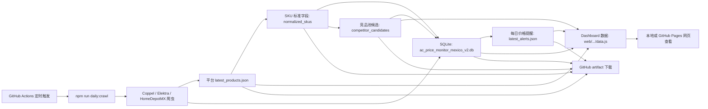

# 竞品分析自动化阶段总复盘与经验

记录时间：2026-06-06

本文件汇总本阶段围绕“墨西哥空调竞品分析网页 + AI 自动化 + 云端每日运行 + SKU 标准字段”的全部关键内容、经验和下一步路线。它是阶段总入口；更细的过程记录见：

- `04_20260606_竞品分析AI自动化执行清单.md`
- `05_20260606_GitHub云端运行测试操作手册.md`
- `06_20260606_GitHub云端三站点验证复盘.md`
- `07_20260606_SKU标准字段与产品系列抽取复盘.md`
- `08_20260606_SKU标准字段30样本复核报告.md`
- `10_20260606_A03竞品池自动分层第一版记录.md`

## 一句话结论

当前方案已经从“每天打开 VPN、手动运行爬虫”升级为“GitHub Actions 云端可定时运行、自动保存 artifact、生成 SQLite 数据库、SKU 标准字段、竞品池候选、每日提醒和 dashboard 数据”的竞品分析 MVP。

短期可以继续用 GitHub Actions 跑 Coppel、Elektra、HomeDepotMX；暂时不需要立刻购买云端代理。长期如果要做稳定历史库、正式 BI 或多人查看，需要把 GitHub cache/artifact 升级为真正的数据库或对象存储。

## 本阶段目标

最初问题有三层：

1. 竞品分析框架中，哪些内容可以由 AI/脚本自动化，哪些必须由人判断。
2. 如何开发一个网页，承载竞品分析信息，并能持续更新。
3. 如何从本机手动运行，升级到云端自动运行，不依赖笔记本电脑一直开着。

本阶段实际闭环了三条主线：

1. A01：多平台商品与价格每日更新。
2. A02：SKU 标准字段自动抽取，重点包括产品系列。
3. A03：竞品池自动分层第一版，重点是 Prime 目标 SKU 的可比较候选。

## 当前系统结构



## 已完成内容

### 1. 竞品分析 AI 自动化清单

已把竞品分析拆成 8 个模块：

| ID | 模块 | 当前状态 |
|---|---|---|
| A01 | 多平台商品与价格每日更新 | 云端 MVP 已跑通 |
| A02 | SKU 标准字段自动抽取 | 已打底并完成 30 样本复核 |
| A03 | 竞品池自动分层 | 第一版已启动 |
| A04 | 价格带与机会区间自动识别 | 已有价格和 dashboard 底座 |
| A05 | Listing 内容诊断 | 待补详情页/内容字段 |
| A06 | 价格变化预警 | 已打底 |
| A07 | 评论与口碑主题挖掘 | 待数据源 |
| A08 | 月度竞品简报自动生成 | 待前置项稳定 |

形成的原则：

- AI/脚本负责重复、结构化、可验证的工作。
- 人负责口径、商业判断、策略决策和最后确认。
- 先把数据底座跑稳，再做规格标准化，再做竞品分层，不要一开始就跳到策略结论。

### 2. 本地每日任务

新增或确认了本地自动化能力：

- `npm run daily:crawl`：每日任务包装器。
- `npm run daily:install`：安装 macOS LaunchAgent。
- `npm run daily:uninstall`：卸载本机定时任务。

本地方式仍然适合调试和人工监督，尤其是 WalmartMX。但如果目标是“电脑不用开着也能跑”，就应优先使用 GitHub Actions 云端方案。

### 3. GitHub Actions 云端方案

已新增工作流：

- `.github/workflows/cloud-daily-crawl.yml`

它会：

1. 在 GitHub 云端临时机器上运行。
2. 安装 Node 依赖和 Playwright Chromium。
3. 恢复上一次的 `data/` cache。
4. 运行 `npm run daily:crawl -- --sites=coppel,elektra,homedepotmx --strict-preflight`。
5. 自动生成 SKU 标准字段、每日提醒、dashboard 数据。
6. 自动生成竞品池候选。
7. 上传 artifact。
8. 可选发布 GitHub Pages。

默认定时：

- 当前配置为 UTC `15:00`，对应蒙特雷当前 UTC-6 时区的上午 `09:00`。
- GitHub 定时任务可能延迟启动，因此只能保证“尽量上午”，不能保证精确到分钟。

关键理解：

- GitHub Actions 是一台临时云电脑。
- 不需要笔记本电脑开着。
- 不会使用本机 VPN。
- 如果目标网站未来封锁 GitHub 云端 IP，可以配置 GitHub Secret：`PROXY_URL`。

### 4. 三站点云端验证

仓库：

- `https://github.com/uvapengwang2023/mx-ac-tracker`

已验证完整三站点云端运行成功：

- GitHub Actions run: `27064477121`
- Artifact: `mx-ac-crawl-27064477121`
- Artifact ID: `7455102690`
- 状态：success
- 运行方式：未配置 `PROXY_URL`，使用 GitHub 云端直连 IP

站点结果：

| 站点 | 云端预检 | 爬虫状态 | 商品数 |
|---|---|---|---:|
| Coppel | 200 OK | success | 434 |
| Elektra | 200 OK | success | 220 |
| HomeDepotMX | 200 OK | success | 138 |

云端 artifact 里的 dashboard 文件已下载并确认能本地打开查看。

重要判断：

- 当前 Coppel、Elektra、HomeDepotMX 可以先不配代理。
- 代理是备用方案，不是当前必须项。
- 触发代理配置的信号是 `403`、`timeout`、`access denied`、验证码、商品数突然为 0 或预检失败。

### 5. 数据保存方式

当前数据会以多种形式保存：

| 形式 | 位置 | 用途 | 局限 |
|---|---|---|---|
| 平台 latest JSON | `data/*/latest_products.json` | 最新商品快照 | 只代表最新结果 |
| SQLite 数据库 | `data/ac_price_monitor_mexico_v2.db` | 历史价格、变化检测、结构化分析 | 在 GitHub artifact/cache 中不是永久生产数据库 |
| SKU 标准字段 JSON/CSV | `data/normalized_skus/` | dashboard、分析、人工复核 | 依赖规则持续校准 |
| 竞品池候选 JSON/CSV | `data/competitor_candidates/` | Prime 目标 SKU 的候选竞品分层 | 是候选池，不是最终竞品名单 |
| 每日提醒 JSON | `data/daily_alerts/latest_alerts.json` | 降价、涨价、新品、下架、覆盖异常 | 依赖至少两次以上稳定运行 |
| Dashboard 数据 | `web/competitor-intel-dashboard/data.js` | 网页展示 | 是生成物，不是原始数据库 |
| GitHub artifact | Actions run 页面下载 | 每次运行结果包 | 默认保留 30 天 |
| GitHub cache | Actions 内部恢复 `data/` | 跨运行保留状态 | 不是可靠永久存储 |

结论：

- 当前形式可以支撑 MVP、每日观察、价格变化、新品/下架提醒。
- 如果要长期严肃分析同一 SKU 价格趋势，SQLite 可以作为本地/Artifact 数据库使用，但 GitHub cache 不应当被当成永久数据库。
- 生产级长期保存建议升级到 Supabase/Postgres、S3/R2、BigQuery 或 VPS 磁盘。

### 6. 每日提醒

已生成：

- `data/daily_alerts/latest_alerts.json`

提醒类型包括：

- 大幅降价；
- 大幅涨价；
- 新品；
- 下架/消失；
- 站点抓取覆盖异常。

默认阈值：

- MXN 500，或
- 5%

这部分后续可以接邮件、飞书、Slack、微信或 dashboard 提醒中心。

### 7. Dashboard

当前 dashboard 已能承载：

- 平台商品数据；
- 价格概览；
- 品牌/容量/价格带分析；
- 每日提醒；
- SKU 标准字段；
- 产品系列分布；
- 竞品池候选；
- 需要人工复核的商品。

本地查看：

```bash
npm run dashboard:build
npm run dashboard:serve
```

打开：

```text
http://localhost:4173
```

云端 artifact 中也会包含完整 dashboard 文件。

### 8. SKU 标准字段自动抽取

已新增：

```bash
npm run sku:normalize
```

输出：

- `data/normalized_skus/latest_normalized_skus.json`
- `data/normalized_skus/latest_normalized_skus.csv`

写入 SQLite：

- `sku_normalized_fields`
- `sku_normalization_runs`

当前抽取字段包括：

- 品牌；
- 产品系列；
- 系列来源；
- 系列置信度；
- 系列类型；
- 型号代码；
- 商品类型；
- 是否真空调；
- 容量 Ton/BTU；
- 电压；
- 变频/定频；
- 冷暖模式；
- 冷媒；
- WiFi；
- 可比较 key；
- 置信度；
- 待复核原因。

最新本地标准化结果：

- 标准化商品数：1174
- 识别为真空调：1014
- 风扇/配件/噪音：160
- 品牌覆盖率：86.6%
- 系列覆盖率：48.3%
- 明确系列覆盖率：18.8%
- 容量覆盖率：90.3%
- 电压覆盖率：76.2%
- 冷暖模式覆盖率：82.6%

重要原则：

- 产品系列不能简单等同于型号，但型号和系列名之间通常有映射关系。
- 标题里明确出现的系列名优先。
- 型号前缀、后缀、字母段可以作为推断系列的重要线索，例如 Prime 的 `B` 后缀可推断 `Bright family`。
- 通过型号特征推断出的系列必须标记为低置信度 `model_family`，进入人工复核，不应直接进入最终商业结论。

### 9. 30 个重点 SKU 抽样复核

已完成 Prime、Mirage、Midea、Mabe、LG 共 30 个样本复核。

结论：

- 通过：17 个
- 部分通过：4 个
- 待人工确认：9 个

已修正规则：

1. Prime 新增 `Trendy`、`Elite`、`Advance`。
2. Prime `B` 后缀恢复为低置信度 `Bright family` 推断，来源是型号特征，不是标题显式系列词。
3. Mirage 新增 `Magnum 22`、`X One`。
4. Mirage 兼容 `Life 12 +`。
5. LG 新增 `Artcool`。
6. Mabe 的 `WiFi Ready`、`3D Air Flow` 不再当产品系列。
7. 控制器配件不再进入真空调集合。
8. `1,2 toneladas (12000 btu)` 优先按 BTU 识别为 `1T`，并保留 `capacity_conflict`。
9. 放宽长型号识别，覆盖 Mabe 的 `MMT12...`、`MMI12...`。

品牌观察：

- Prime：`Trendy`、`Elite`、`Advance`、`Bright`、`Bright 3` 可以识别；`B` 后缀可作为型号特征推断 `Bright family`，但必须保留低置信度和人工确认状态。
- Mirage：`XR`、`NEX`、`X Life`、`Life12 Plus`、`Magnum 22`、`V32` 较成熟。
- Midea：`Fresh`、`EcoMaster`、`Comfee Aurora` 可识别；`MAS/MAW/MAP` 还只是型号族。
- Mabe：当前没有可靠明确系列；`MMI/MMT/PTM` 先保留为型号族。
- LG：`Dual Cool`、`Dual Cool AI Air`、`Artcool` 可识别；`Smart` 不当系列。

### 10. A03 竞品池自动分层第一版

已新增：

```bash
npm run competitors:build
```

输出：

- `data/competitor_candidates/latest_competitor_candidates.json`
- `data/competitor_candidates/latest_competitor_candidates.csv`

写入 SQLite：

- `competitor_candidate_runs`
- `competitor_candidates`

当前第一版口径：

- 目标池：Prime 空调 SKU。
- 候选池：所有已识别为空调、价格和容量可用的商品。
- 匹配字段：产品类型、容量、单冷/冷暖、电压、变频/定频、价格接近度、品牌、系列信号。
- 层级：直接竞品、强候选、价格/规格参照、内部参照、观察项。
- 人工关口：A03 输出的是候选池，不是最终名单；最终真竞品、弱竞品、不可比仍需要人工确认。

当前结果：

- Prime 目标 SKU：27 个。
- 候选关系：318 条。
- 直接竞品：171 条。
- 强候选：145 条。
- 价格/规格参照：2 条。
- 有直接或强候选覆盖的目标 SKU：27 个。

新增 dashboard 模块：

- `竞品池候选`
- 展示每个 Prime 目标 SKU 的候选数量、候选层级、候选品牌、系列、规格、价格、价差、可比原因和风险。

## 人和 AI/脚本的分工

### AI/脚本适合做

- 每天定时抓取商品和价格。
- 保存快照、数据库、日志和 artifact。
- 比较价格变化、新品、下架、覆盖异常。
- 从标题抽取结构化字段。
- 生成 dashboard 数据。
- 生成候选竞品池。
- 生成待复核清单。
- 汇总周期性报告草稿。

### 必须由你判断

- 哪些站点是必须覆盖的平台。
- 是否购买云端代理，以及接受什么成本。
- Prime 自有产品系列的最终命名。
- 竞品是否真正可比。
- 型号族是否等于商业产品线。
- 价格预警阈值是否符合业务。
- 降价后是否跟价、避战或差异化。
- 月度报告里的策略结论。

## 阶段经验

### 经验 1：先验证直连，再买代理

一开始直觉上会觉得墨西哥站点必须用美国/墨西哥代理。但本次 GitHub 云端直连三站点都跑通了，所以正确动作是先测试，再采购代理。代理要保留为备用，不要先增加成本和复杂度。

### 经验 2：GitHub Actions 不是长期数据库

GitHub Actions 可以自动运行，也能用 artifact/cache 保存数据，但它不是数据库产品。Artifact 只有保留期，cache 也可能失效。MVP 可以用，长期应升级到真实存储。

### 经验 3：第一次运行只能建立基线

价格变化、新品、下架判断至少需要两次以上运行。第一次云端运行成功，说明链路通了；第二次以后才开始具备变化检测价值。

### 经验 4：不要把不确定字段伪装成确定字段

`reviewNeeded` 很高不是问题。它说明系统正在诚实标记不确定性。比如 `model_family` 不是最终系列，缺电压也不能硬补。竞品分析最怕“看起来完整但实际错”的数据。

### 经验 5：产品系列是业务字段，不只是文本字段

系列名不是所有好看的词，也不是所有型号前缀。`WiFi Ready`、`3D Air Flow`、`Smart` 更像功能或营销词，不能直接当产品线。但型号与系列名之间经常存在关系，型号前缀/后缀可以用于推断候选系列，例如 Prime `EMPRC182-B` 中的 `B` 可以作为 `Bright family` 的低置信度线索。系列字段需要业务校准。

### 经验 6：抽样复核比一次性追求全自动更有效

30 个重点 SKU 复核能快速发现高价值规则问题。每次复核后把规则写回脚本，下一次云端运行就自动变好。这比人工维护一张静态表更有复利。

### 经验 7：云端任务要把失败原因保存下来

无人值守任务最重要的不是永远成功，而是失败时能看到原因。预检、日志、latest_run、artifact 都是为了让失败可诊断。

### 经验 8：WalmartMX 应该单独处理

WalmartMX 当前可能涉及人工验证，不适合混进无人值守每日任务。默认云端先跑 Coppel、Elektra、HomeDepotMX，是更稳的分阶段策略。

### 经验 9：dashboard 是结果入口，不是唯一数据源

网页负责查看和决策辅助；数据库、JSON、CSV 才是分析底座。后续做价格趋势、同 SKU 价格波动、新品提醒，应该优先基于 SQLite 或未来数据库。

### 经验 10：每天上午跑即可，不需要精确到分钟

竞品分析不是秒级监控。按蒙特雷时间每天上午跑一次已经足够，GitHub Actions 有轻微延迟可以接受。

### 经验 11：竞品池先做候选，不要直接替人下结论

A03 的价值是把几百个商品先自动分成可复核的候选关系，让你只看高相关商品。它不能替代最终商业判断，尤其当电压、冷暖、型号族或系列名仍有缺失时，应降级为强候选或参照，而不是直接写成最终竞品。

## 当前风险

1. GitHub 云端直连 IP 未来可能被站点限制。
2. Artifact 默认保留 30 天，不适合长期历史留存。
3. GitHub cache 可用于 MVP，但不能当生产级数据库。
4. WalmartMX 仍需人工验证，不适合无人值守。
5. SKU 系列覆盖率仍不高，尤其 Midea/Mabe 需要业务确认。
6. 当前多为标题抽取，详情页规格和评论数据还没有完全进入结构化分析。
7. 同一 SKU 跨平台匹配还没有闭环。
8. A03 竞品分层仍是候选逻辑，直接竞品和强候选需要抽样复核。

## 下一步建议

### 下一步 1：重点品牌系列词典

目标：把 `named_series` 和 `model_family` 的边界确认下来。

优先顺序：

1. Prime
2. Mirage
3. LG
4. Midea
5. Mabe

建议输出：

- `data/sku_dictionaries/brand_series_dictionary.json`
- 字段包括品牌、系列名、别名、匹配模式、是否人工确认、备注。

### 下一步 2：A03 竞品池抽样复核

目标：从第一版候选池中抽样复核，校准分层阈值。

建议复核：

- 每个 Prime 重点系列抽 2-3 个目标 SKU。
- 每个目标 SKU 看直接竞品前 3 个、强候选前 3 个。
- 人工标记：真竞品、弱竞品、不可比、字段错误。
- 根据复核结果调整直接竞品阈值、重点品牌权重和系列词典。

### 下一步 3：连续云端观察 2-3 天

确认：

- 定时任务是否每天自动触发。
- 商品数是否稳定。
- cache 是否能支持变化检测。
- artifact 是否包含 dashboard、SQLite、alerts、normalized_skus、competitor_candidates。

### 下一步 4：决定长期数据库

如果这个项目要长期用，建议在下面方案里选一个：

- Supabase/Postgres：适合后续 dashboard 和 SQL 分析。
- S3/R2：适合便宜保存每日快照。
- BigQuery：适合长期大规模分析。
- VPS 磁盘 + SQLite/Postgres：适合自己掌控运行环境。

## 当前状态判断

A01 已经基本闭环：云端能跑、数据能保存、artifact 能下载、dashboard 能查看。

A02 可以阶段关闭：字段抽取、产品系列、抽样复核、规则回写都完成了第一轮。但 A02 还需要通过“重点品牌系列词典”继续提高产品线准确率。

A03 已经启动第一版：系统可以自动生成竞品候选池，并接入 dashboard 和云端 artifact。接下来最自然的动作是对 A03 做抽样复核，确认哪些候选可以进入最终竞品名单。
